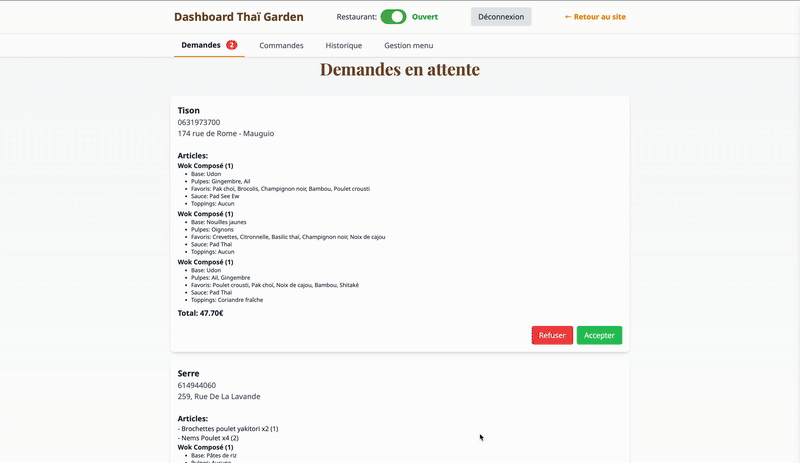

# Thaï Garden – Plateforme de commandes en ligne

Ce dépôt contient tout le code du site du restaurant **Thaï Garden** de Mauguio. Vous pouvez consulter la version en production à l'adresse <https://thai-garden-mauguio.fr>.

L'objectif du projet est de proposer une expérience de commande moderne et responsive, que ce soit pour les clients (consultation du menu, création d'un wok personnalisé, suivi de commande) ou pour l'équipe en cuisine via un tableau de bord temps réel.

## 🎬 Démonstrations

### Interface client


### Interface administration


## Table des matières
- [Fonctionnalités principales](#fonctionnalités-principales)
- [Technologies](#technologies)
- [Structure du dépôt](#structure-du-dépôt)
- [Mise en route](#mise-en-route)
- [Configuration de Supabase](#configuration-de-supabase)
- [Base de données](#base-de-données)
- [Licence](#licence)

## Fonctionnalités principales
- **Menu dynamique** accessible sur `index.html` et `menu.html`.
- **Wok à composer** avec choix des bases, ingrédients et toppings (voir `js/wok.js`).
- **Dashboard d'administration** (`admin.html`) connecté à **Supabase** pour gérer en temps réel les plats et les commandes.
- **Suivi de commande client** via `suivi.html`.
- **PWA** : manifest, Service Worker (`sw.js`) et possibilité d'installer le site sur mobile.
- **Notifications** pour informer le personnel de nouvelles commandes.

## Technologies
- **HTML5** et **Tailwind CSS** pour la partie front.
- **JavaScript** vanilla pour les interactions et l'intégration Supabase.
- **Supabase / PostgreSQL** pour la persistance des données.
- **Service Worker** pour la couche PWA et les notifications.

## Structure du dépôt
- `index.html`, `menu.html`, `commande.html`, `admin.html`, `suivi.html` – pages principales de l'application.
- `css/` – styles et configuration Tailwind.
- `js/` – scripts (menu burger, gestion du wok, client Supabase...).
- `bdd/` – scripts SQL permettant de créer les tables nécessaires (menu, commandes, statut restaurant...).
- `assets/` – images et icônes.

## Mise en route
1. **Cloner le projet**
   ```bash
   git clone https://github.com/nanotchec/site-de-commandes-en-ligne-restaurant.git
   cd site-de-commandes-en-ligne-restaurant
   ```
2. **Lancer un serveur local**
   ```bash
   python3 -m http.server 8000
   ```
   Ouvrez ensuite <http://localhost:8000> dans votre navigateur.
3. **Configurer Supabase** : voir la section ci-dessous.

## Configuration de Supabase
Le fichier `js/supabase-client.js` contient des clés publiques de démonstration. Remplacez-les par vos propres identifiants Supabase (URL et clé anonyme). Veillez à ne pas committer vos clés privées.

## Base de données
Le répertoire `bdd/` regroupe les scripts SQL pour créer les tables `menu`, `wok_*`, `orders` et autres. Importez-les dans votre instance PostgreSQL/Supabase pour avoir une structure identique à celle du site.

## Licence
Le projet se réfère à la licence Creative Commons **CC BY-NC 4.0**, mais aucun fichier `LICENSE` n'est fourni dans ce dépôt.
 
EOF
)
